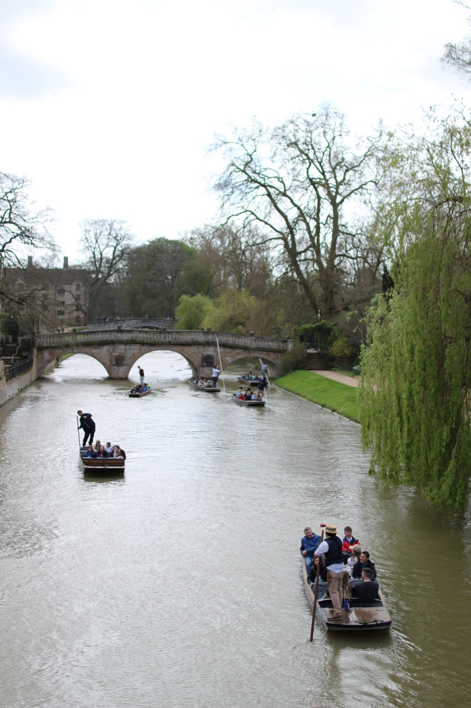
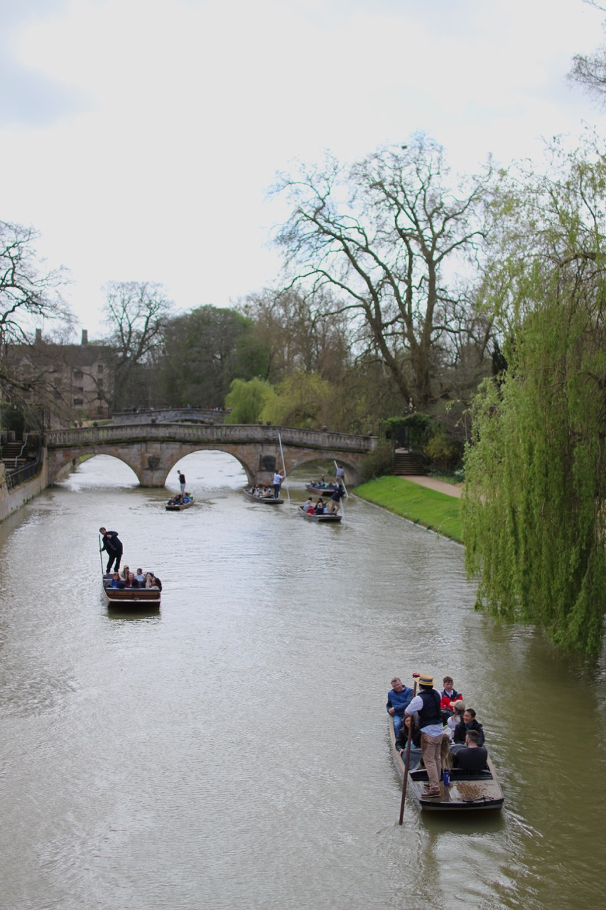
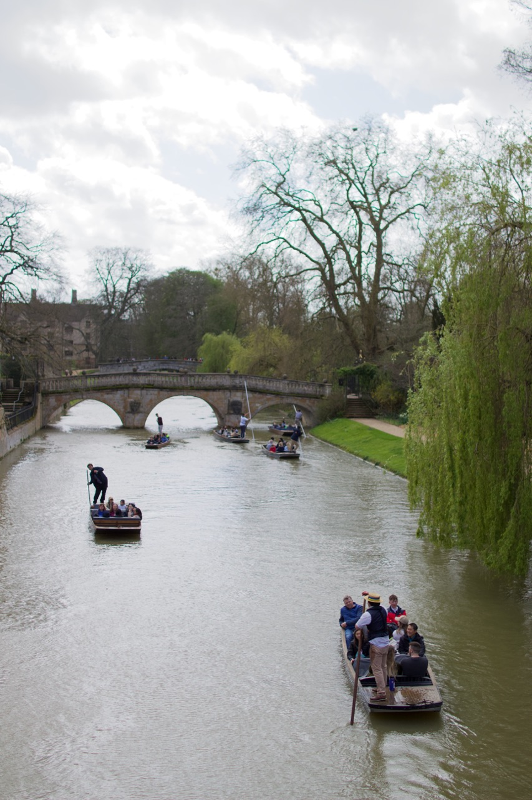

# Photography in `RAW` 

RAW is a way of saving images on a camera with minimal post processing and no lossy compression, it's common on proffessional cameras and increasingly available on mobile phones.

## What does `RAW` do better?

Let's cut right to understanding why photographers ramble on about RAW with an example photo. I set my camera to save it in both RAW and JPEG, there's no visible difference between the two at this stage.

    

### Editing

The clouds and sky are over exposed, monotonically white, it's not what I saw when I took the photo. This happened because the scene had high variation in brightness, the camera doesn't have the "dynamic range" to correctly set the exposure for all of the image.

I'd like to retrieve some detail in the clouds, by transforming the intensities of pixels in the clouds in a way that spreads them out, so that the details become visible.

We can do this by adjusting the "highlights", a slider you'll find in the MacOS photos app for example, which I used to do this editing. This will apply an intensity transform to the brightest parts of the image, which is the sky in this case, exactly what we want. Adjusting the highlights of both images to `-0.7`, reveals the detail again in the RAW image, but not in the JPEG:

| Edited JPEG| Edited RAW|
|:-:|:-:|

## Why does `RAW` enable this?

In the original, the intensities of those sky pixels were so close in value that the differences were invisible to the eye. JPEG was designed to take advantage of this to throw away that data and achieve compression. As a consequence the highlight adjustment just dims the sky a little. The RAW image on the other hand, retained the slight differences in intensity, enabling the transform to reveal them again.

